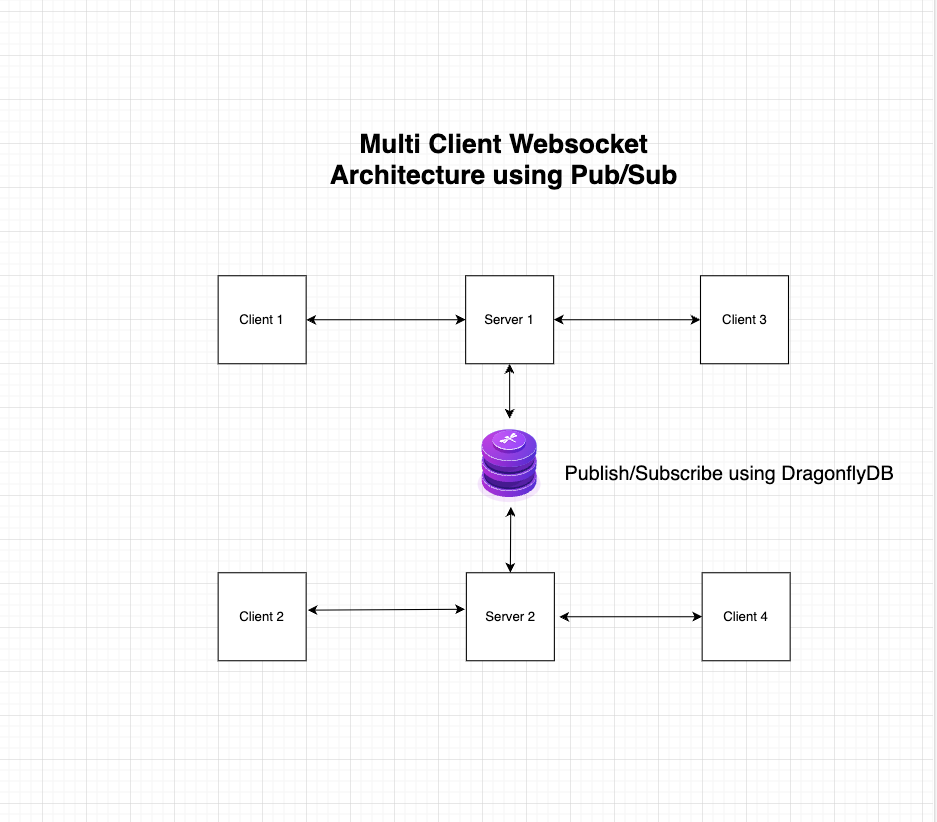

# Spring Boot Real Time Chat Application using Websocket and Dragonfly DB

This project contains source code to implement a Real Time Chat application using Spring Boot Websockets and Dragonfly DB for Pub/Sub Architecture.

## Tech Stack

- Spring Boot with Websockets
- Dragonfly DB for Pub/Sub Pattern

## Application Architecture



## Running Application

- Start DragonflyDB by running the below command
```text
docker compose up -d
```
- Run 2 of the Chat application by running below command
```text
mvn spring-boot:run -Dspring-boot.run.profiles=instance1
mvn spring-boot:run -Dspring-boot.run.profiles=instance2
```
- Open Multiple Browser windows, some with http://localhost:8080 and http://localhost:8081
- Enter your username and send messages, the chat messages will be broadcasted to all the users